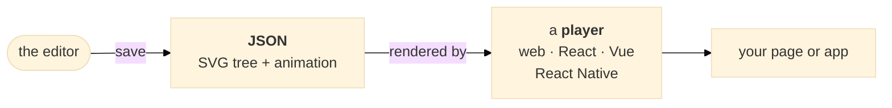
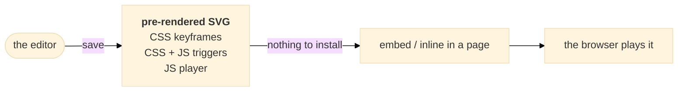
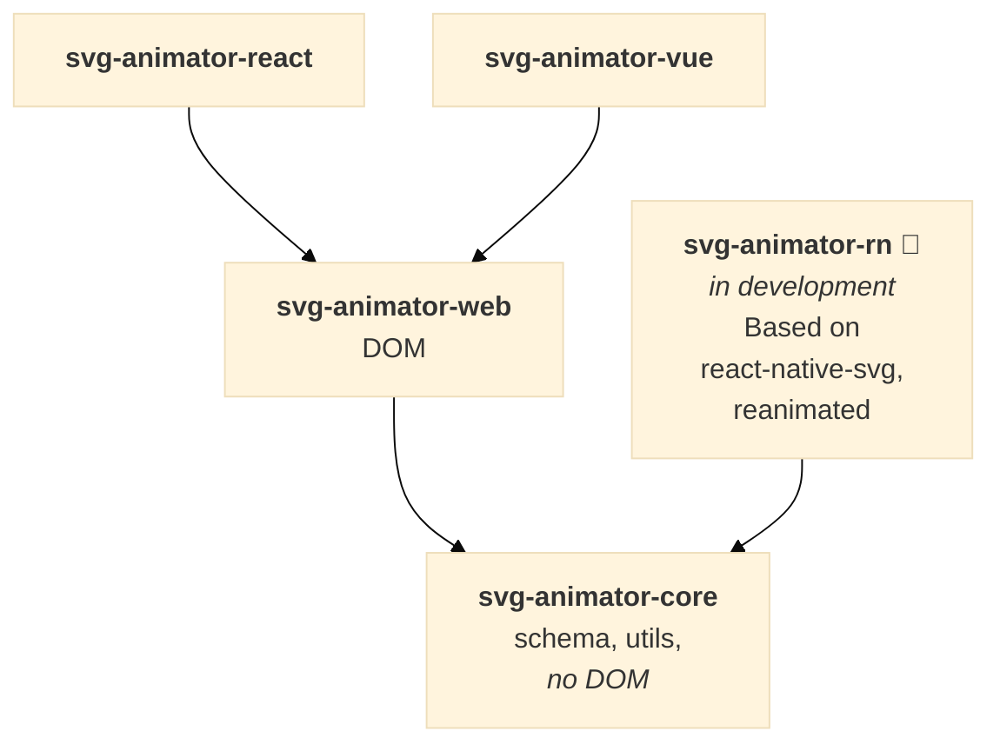

Pixodesk SVG Animator is an **editor** that makes SVG animations, a set of **players** that
run them, and the **file format** that connects the two. You make the animation once, save it
as a file, and that file plays anywhere SVG does.

**The editor** is a full-featured vector and animation tool. Draw shapes, paths and text, or
import SVG from Illustrator, Figma, Inkscape and other design tools. Animate any property on a timeline,
add effects, then save. It also imports and exports **Lottie**, and exports to video, GIF and
static images when you need a fallback. It ships for Windows and Mac from
[pixodesk.com](https://pixodesk.com) — on its own, and in *Pixodesk Animator Studio*, the
edition that adds *Pixodesk 2D Animator (Lottie)*.

**The players** are small, open-source runtime libraries — MIT-licensed, published on npm as
`@pixodesk/svg-animator-*`, and developed in [this repository](https://github.com/pixodesk/pixodesk-svg-animator#readme). Pick the one for
where the animation runs: plain **HTML**, **React**, **Vue** or **React Native**. Control
playback from code — play, pause, speed — or let the animation start itself on
load, click or scroll.

**The format** stays as close to plain SVG as it can, with a wide vector feature set. It comes
in two flavours:

- **JSON** — the source: the SVG tree plus its animation, read by a player.
- **Pre-rendered SVG** — a normal `.svg` with the animation already inside, ready to embed or
  inline straight into a page. Three variants:
  - **SVG + CSS animation** — pure CSS keyframes, no JavaScript at all
  - **SVG + CSS animation + JS triggers** — the same, plus a few inline lines of script (added by the editor app) for click and scroll triggers
  - **SVG + JS animation** — the player embedded in the file, running on the engine you choose, **WAAPI** or **frames**

The two flavours take different routes to the screen:

## Use for

- Splash screens
- Animated backgrounds
- Icon animations
- Loaders
- Illustrations that react to hover, click or scroll
- Animated logos

## JSON and pre-rendered SVG

**JSON** is the source format: a small document describing the SVG tree plus its animation.
A player library renders it and gives you complete runtime control — play, pause, jump to any point,
reverse, speed — and supports every animation type on every browser. It is the right choice
for apps (React / Vue / React Native), for complex animations, and whenever you need to drive
the animation from code.

**Pre-rendered SVG** is a normal `.svg` file with the animation built in. Drop it into any
page, CMS or static-site generator and it plays — no library needed for the CSS flavour. It is
the simplest option and the right one for most icons, loaders and decorative animation. Its
one rule: **inline each file only once per page** — its element ids are fixed, so a second copy
collides with the first ([read more](/docs/svga/prerendered-svg/on-the-web#one-copy-of-a-file-per-page)). For several instances of one animation, use JSON.

Both JSON and animated SVG have the same features, and the editor converts between them at any time
(**File → Save as JSON / Save as SVG**), so the choice is never final.

## Which package do I need?

First pick the format — [Choosing a format](/docs/svga/editor/choosing-a-format) has the
side-by-side comparison. A **pre-rendered SVG** needs no package at all
([Pre-rendered SVG on the web](/docs/svga/prerendered-svg/on-the-web)); **JSON** needs the
player for your stack ([installation overview](/docs/svga/player-library/installation)):

| Your stack | Package |
|---|---|
| Vanilla JavaScript | `@pixodesk/svg-animator-web` |
| React / Next.js | `@pixodesk/svg-animator-react` |
| Vue / Nuxt | `@pixodesk/svg-animator-vue` |
| React Native / Expo 🧪 *(in development)* | `@pixodesk/svg-animator-rn` |
| The core every player builds on — the format schema and the shared algorithms | `@pixodesk/svg-animator-core` |

The React and Vue packages wrap the web player; every player shares the core, so the same
document produces the same frames everywhere:

## Where next

- Deciding on a format → [Choosing a format](/docs/svga/editor/choosing-a-format)
- Learning the editor → [The editor](/docs/svga)
- Embedding a pre-rendered SVG → [Pre-rendered SVG on the web](/docs/svga/prerendered-svg/on-the-web)
- Installing a player → [Installing the players (overview)](/docs/svga/player-library/installation)
- Understanding the file → [Format principles](/docs/svga/format#format-principles), [JSON format reference](/docs/svga/format#json-format-reference)

