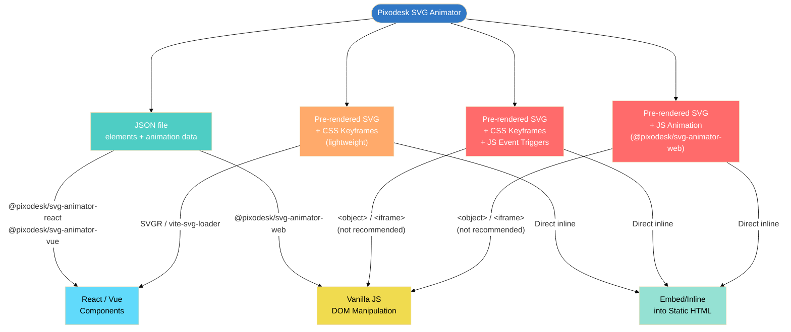

As the [Introduction](/docs/svga/editor/how-it-fits-together) covered, the editor saves an animation in one of two formats: **JSON**, which a player library renders, or **pre-rendered SVG**, which a
browser plays on its own. This page is about picking between them — and, for pre-rendered SVG,
between its three flavours.

Both JSON and animated SVG are the same document in a different shape. You can switch at any time —
**File → Save as JSON / Save as SVG** — so the choice is never final.

## The formats at a glance

| Format | File | What is inside | Needs a library? |
|---|---|---|---|
| **JSON** ("Pixodesk JSON") | `.json` | the SVG tree + animation data + editor metadata | yes — a player renders it |
| **Pre-rendered SVG + CSS animation** | `.svg` | ordinary SVG + a `<style>` with `@keyframes`; starts on load, or on hover through CSS `:hover` | no |
| **Pre-rendered SVG + CSS animation + JS triggers** | `.svg` | the above + a few lines of inline script — no library — that start/stop it on hover, click or scroll into view | no (the snippet is inline) |
| **Pre-rendered SVG + JS animation** | `.svg` | ordinary SVG + the web player embedded in a `<script>` (25–38 KB) | no (the player is inline) |

The editor can also export **Lottie** (`.json` / `.lottie`), **video**, **GIF** and **image**
snapshots — see [Save, File Format](/docs/svga/editor/save).

## The decision, short version

**JSON** fits code: React, Vue, React Native, or vanilla JavaScript that needs runtime control.
**A pre-rendered SVG** fits a file you drop into a CMS or static site with minimal setup — and
that you need **once per page** ([read more](/docs/svga/prerendered-svg/on-the-web#one-copy-of-a-file-per-page)).

| Situation | Pick |
|---|---|
| React / Vue / Next.js / Nuxt app | **JSON** with the framework component — SSR-safe, full runtime control, every animation type. *Or* a **CSS-flavour SVG** imported like an icon (SVGR / `vite-svg-loader`) when you only need it to play, not to be controlled |
| Vanilla JavaScript page, you want play/pause from code | JSON + the web player, `@pixodesk/svg-animator-web` |
| Static site generator or CMS (Astro, Jekyll, WordPress, Shopify, Webflow) | **any pre-rendered SVG** — the platform inlines the file; even the flavours with a `<script>` just work when inlined |
| Loader / icon / decorative loop, no interaction | **SVG + CSS animation** — smallest, zero JavaScript |
| Start on hover without writing code | **SVG + CSS animation** — the export uses CSS `:hover`, no script at all |
| Start on click or scroll into view without writing code | **SVG + CSS + JS triggers** — a few inline lines (added by the editor app), no library |
| Content must be visible before any JavaScript runs, but the animation uses path morphing or another CSS-unsupported feature | **SVG + JS animation** — the SVG is in the page from the first paint; the embedded player (25–38 KB) takes over and drives every animation type |
| Several copies of the **same** animation on one page | **JSON** — each instance gets fresh element ids; inlined SVGs can collide on ids |

### Pros and cons

| Format | Advantages | Limitations |
|---|---|---|
| **JSON** | • Every animation type on every browser • full runtime control (play, pause, jump to any point, reverse, change speed) • clean per-instance rendering, no id conflicts • SSR-safe | You install a player package and add a few lines of code — the `.json` file does nothing on its own, unlike a pre-rendered SVG you can simply paste in |
| **SVG + CSS** | • No library, smallest file • no `<script>`, so it works inline and through SVGR • starts on load or on hover (`:hover`) • drop-in icon replacement | • Only what CSS `@keyframes` can express — see *What each engine can animate* below • path morphing only between same-structure paths, and not in older browsers • no runtime API — playback is controlled with CSS classes • **id conflicts if inlined twice** ([one copy per page](/docs/svga/prerendered-svg/on-the-web#one-copy-of-a-file-per-page)) |
| **SVG + CSS + JS triggers** | Same as above plus click and scroll-into-view triggers, out actions and reset-on-finish — a few inline lines, no library | • Same CSS limits • no precise control (no jumping to a time, no reverse, no speed change) • the `<script>` prevents SVGR use • **id conflicts if inlined twice** ([one copy per page](/docs/svga/prerendered-svg/on-the-web#one-copy-of-a-file-per-page)) |
| **SVG + JS animation** | • Every animation type • full runtime control • self-contained | • Embeds the player (25–38 KB) • the `<script>` prevents SVGR use • possible id conflicts if inlined twice |

## What each engine can animate

Three things can drive an animation. The **SVG + CSS animation** flavour is driven by CSS
`@keyframes` alone. **JSON** and the **SVG + JS animation** flavour are driven by the player,
which has two engines: the **Web Animations API** (native, very smooth) and a **frame loop**
(`requestAnimationFrame`, universal). With the default `mode: 'auto'` the player picks WAAPI
and **falls back to frames automatically** whenever the document animates something WAAPI
cannot express — so with a player every row below *just works*. The columns tell you which
mechanism drives it and, more importantly, what the **CSS flavour** cannot do.

| Animation type | **SVG + CSS animation** CSS `@keyframes` | **JSON · SVG + JS animation** Web Animations API engine | **JSON · SVG + JS animation** Frame loop engine |
|---|---|---|---|
| Numeric attributes (opacity, stroke-width…) | ✅ | ✅ | ✅ |
| Position (x, y, cx, cy, r, rx, ry) | ✅ ¹ | ✅ ¹ | ✅ |
| Size (width, height) | ✅ ¹ | ✅ ¹ | ✅ |
| Transform (translate, rotate, scale, skew) | ✅ | ✅ | ✅ |
| Colours (fill, stroke) | ✅ | ✅ | ✅ |
| Path morphing (`d`) | ⚠️ recent browsers ² | ❌ | ✅ |
| Stroke dash | ✅ | ✅ | ✅ |
| Gradient stops | ⚠️ colour only ³ | ❌ | ✅ |
| Gradient geometry | ❌ | ❌ | ✅ |
| Filters (blur, brightness…) | ❌ | ❌ | ✅ |
| Clip-path / mask morphing | ❌ | ❌ | ✅ |
| Text on a path (`startOffset`) | ❌ ⁴ | ❌ | ✅ |
| Performance | ⚡ excellent | ⚡ excellent | good |
| Browser support | universal | modern browsers | universal |

¹ Geometry as CSS properties works in Chromium and WebKit; **Firefox does not implement it** —
use JSON (frames fallback) when cross-browser geometry animation matters.
² CSS `d: path()` needs identical path command structure across keyframes, and older browsers
do not support it at all (Safari added it only recently). When it matters, use JSON — the
frame loop morphs paths everywhere.
³ Per-stop `stop-color` animates via CSS; stop `offset` and gradient geometry cannot be
expressed in CSS at all.
⁴ The static text-on-path layout renders everywhere; only animating `startOffset` /
`textLength` is impossible in CSS.

The editor warns you at every step. While you work, an attribute the chosen SVG flavour cannot
animate is flagged on its timeline row and in the file-type picker, and the toolbar's
**App warnings** button lists them all with a one-click fix (*switch to SVG + JS (Auto)*). When
you save or export, the same list is shown once more as a notice — *"Some animations are not
supported in this export format"* — together with any feature the pre-rendered file may not
reproduce exactly. Nothing is silently dropped.

### Engine pros and cons

| Engine | Advantages | Limitations |
|---|---|---|
| **CSS `@keyframes`** | • No JavaScript at all • the browser plays it by itself, so it stays smooth even while the page is busy • nothing to load • can start on mouse over, using plain CSS | • The smallest feature set — see the ❌ cells in the *What each engine can animate* table above • geometry properties do not animate in Firefox • no runtime API — playback is controlled with CSS classes |
| **Web Animations API** | • Played by the browser itself, so it stays smooth even while the page is busy • full runtime control • no JavaScript runs while it plays | • Cannot express structural changes: path morphing, gradient geometry, filters, masks, text on a path • modern browsers only |
| **Frame loop** | • Every animation type, in every browser • full runtime control • the only engine for path morphing in older Safari | • JavaScript updates the SVG on every frame, so a page that is busy with other work can make it stutter • runs uncapped unless you set `frameRate` • still fast in practice, but the Web Animations API stays smoother under load |

In JSON you rarely choose: `mode: 'auto'` uses WAAPI and switches to the frame loop only for
what WAAPI cannot do. The choice that matters is the pre-rendered one — **SVG + CSS** locks
you to the first row.

## Converting between formats

Any time: open the document and **File → Save as JSON** or **Save as SVG**. Keep the JSON as
your master copy — it holds the animation exactly as you authored it, with every effect still
an effect. The pre-rendered SVG is the finished result, everything already expanded into plain
SVG: the file you put on a page. Both re-open in the editor.

## How each format reaches a page

Every route from the editor's exports to a running animation (`<object>`/`<iframe>` embedding works but is [not recommended](/docs/svga/prerendered-svg/on-the-web)):

